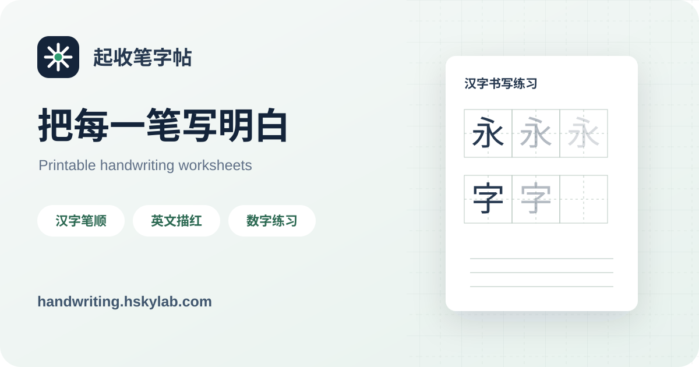
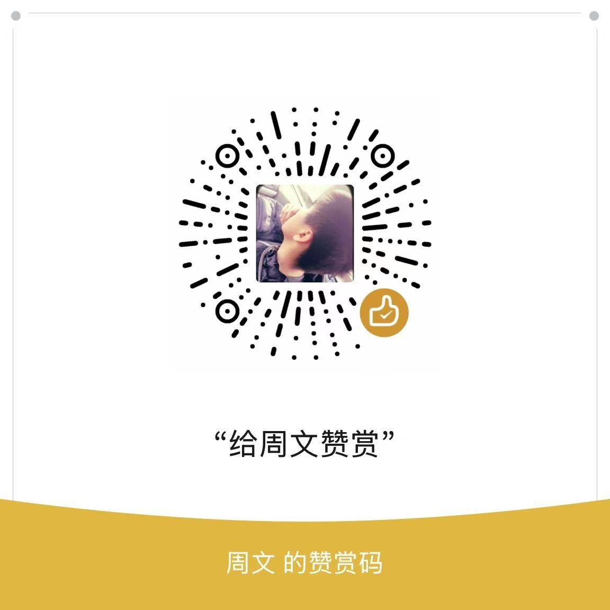

# 起收笔字帖

**简体中文** | [English](README_EN.md)



[在线使用](https://handwriting.hskylab.com/) · [源码仓库](https://github.com/hskyzhou/stroke-guide-worksheets) · [提交问题或建议](https://github.com/hskyzhou/stroke-guide-worksheets/issues/new/choose) · [支持项目](https://ko-fi.com/hskylab) · [开发计划](ROADMAP.md)

一个在浏览器中生成中文、英文和数字练习字帖的静态网页。支持笔顺、起收笔与方向提示、逐笔加画、指定笔画练习、拼音、描红、教材生字预设以及 A4 打印。

网站地址：<https://handwriting.hskylab.com/>

## 功能

- 中文字帖：田字格、米字格、方格，汉字笔顺和逐笔练习
- 英文字帖：大小写 A–Z、四线三格、单行与单字母整页练习
- 数字字帖：0–9 书写顺序和方向提示
- 教材预设：统编语文一至六年级上下册会写字
- 本地配置：设置保存在浏览器 `localStorage`，不需要账户
- 打印输出：按 A4 分页，可通过浏览器保存为 PDF

## 本地运行

项目不需要构建。在仓库目录启动任意静态文件服务器：

```bash
python3 -m http.server 4173
```

然后访问 <http://localhost:4173>。

汉字笔画数据已随项目保存并由页面按需加载。请使用静态文件服务器运行项目；直接打开 `index.html` 时，浏览器可能限制本地 JSON 请求。

## 隐私与网络请求

输入内容和自定义配置在浏览器内处理；配置仅写入当前浏览器的 `localStorage`。项目自身没有账户、分析统计或服务端存储。

Patrick Hand 字体、`pinyin-pro` 拼音库和汉字笔画数据均随项目本地保存。页面启动时不依赖 Google Fonts、jsDelivr 或外部笔画数据服务；只有用户主动点击 Ko-fi、数据来源等外部链接时才会离开本站。

部署者如果加入统计、账户或服务端功能，应相应更新隐私说明。

## 数据与书写规范

字母和数字使用项目内维护的基础书写路径。不同地区、教材和教师可能采用不同写法，修改时请在 Issue 或 Pull Request 中说明依据。

教材生字预设根据统编语文各册写字表整理。教材修订可能改变课次和生字，使用时以手中教材为准。详细边界见 [`DATA_SOURCES.md`](DATA_SOURCES.md)。

汉字笔画轨迹使用随项目保存的 [Hanzi Writer Data](https://github.com/chanind/hanzi-writer-data) 2.0.1，拼音使用 [pinyin-pro](https://github.com/zh-lx/pinyin-pro)。第三方许可见 [`THIRD_PARTY_NOTICES.md`](THIRD_PARTY_NOTICES.md)。

## 参与贡献

欢迎提交字表纠错、笔顺依据、打印问题和代码改进。请先阅读 [`CONTRIBUTING.md`](CONTRIBUTING.md)。报告安全问题请参阅 [`SECURITY.md`](SECURITY.md)。

请通过 [GitHub Issues](https://github.com/hskyzhou/stroke-guide-worksheets/issues/new/choose) 提交问题或建议，也可以发送邮件到 [xezw211@gmail.com](mailto:xezw211@gmail.com)。请勿附带学生姓名、学校或联系方式等个人信息。

版本变化见 [`CHANGELOG.md`](CHANGELOG.md)，发布与推广文案见 [`PROMOTION.md`](PROMOTION.md)。

## 许可证

除第三方材料和另有说明的内容外，本仓库中的原创程序代码以 [GNU Affero General Public License v3.0](LICENSE) 授权。

AGPL-3.0 允许使用、修改、再发布和商业使用。修改后的版本通过网络向用户提供服务时，需要按照许可证向这些用户提供相应源代码。

项目名称、标识以及第三方字体、笔画数据和教材相关内容不因代码采用 AGPL-3.0 而自动获得相同授权。详见 [`THIRD_PARTY_NOTICES.md`](THIRD_PARTY_NOTICES.md) 和 [`DATA_SOURCES.md`](DATA_SOURCES.md)。

## 支持项目

项目计划保持基础字帖生成功能免费。赞赏完全自愿，将用于服务器、教材字表整理、笔顺校对和功能维护。

### 国内 · 微信赞赏

<p align="center">
  
</p>

扫码前请核对微信显示的收款方信息。

### 海外 · Ko-fi

可以通过 [Ko-fi](https://ko-fi.com/hskylab) 使用 PayPal 支持项目。
